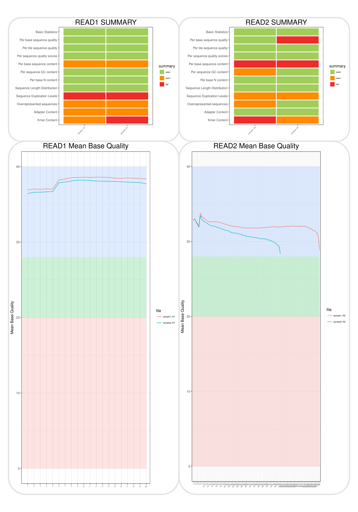
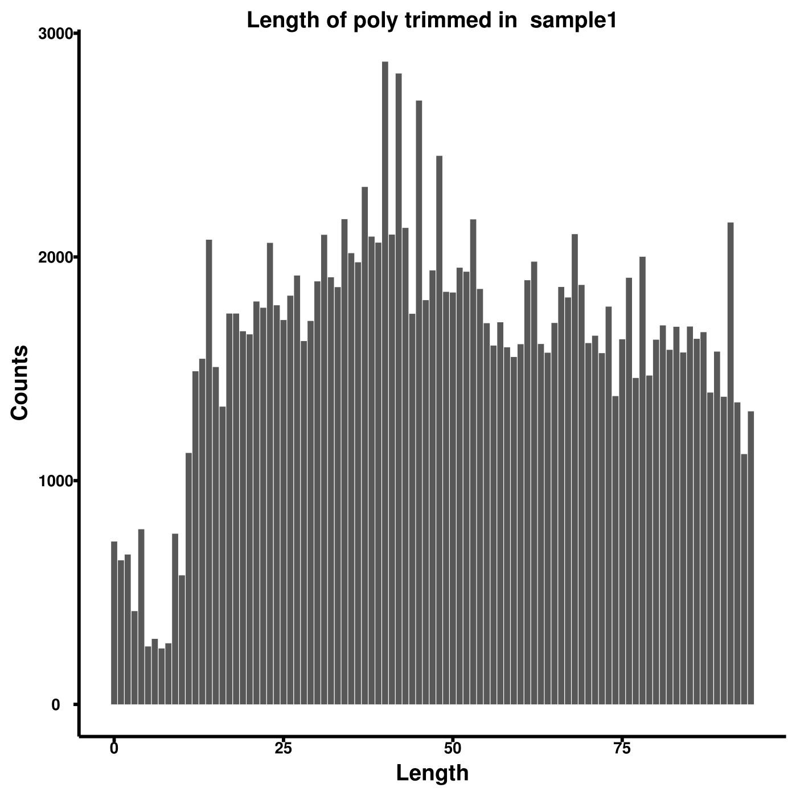
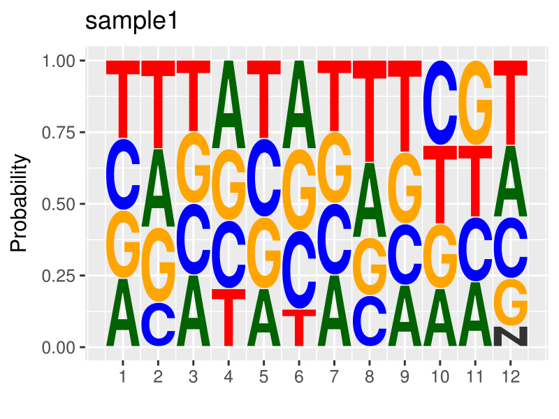
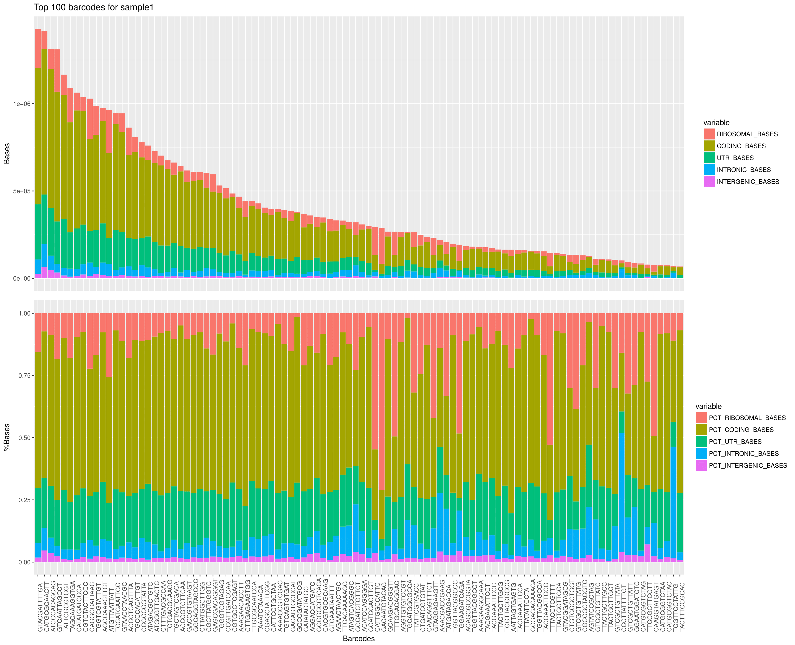
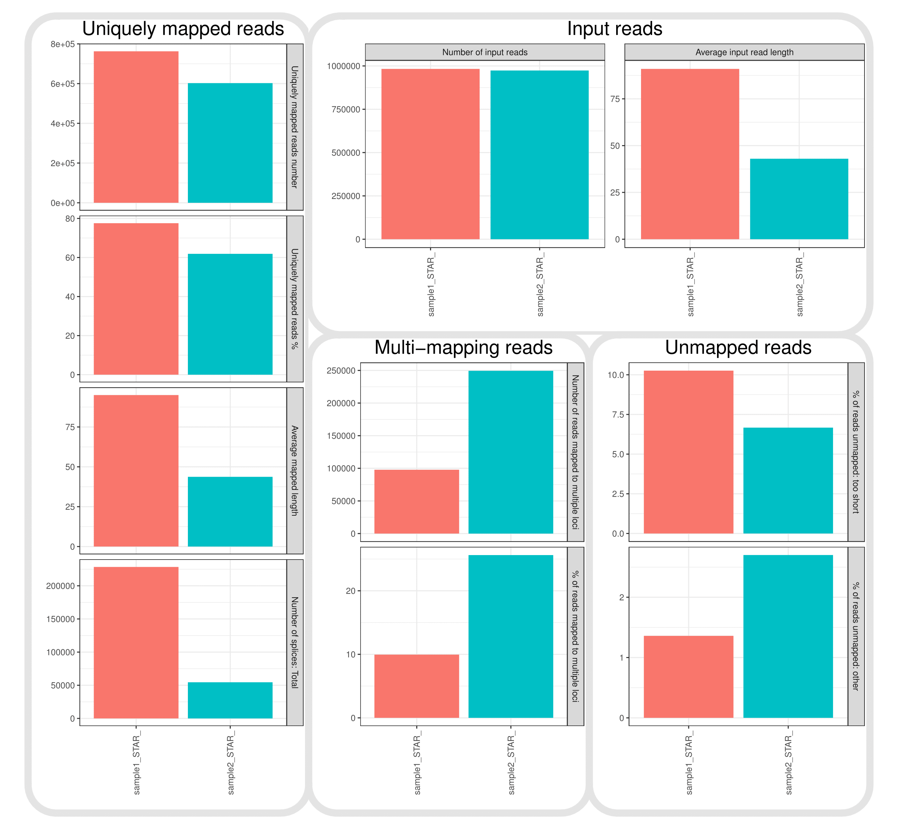

Description
------------------
This pipeline is based on [snakemake](https://snakemake.readthedocs.io/en/stable/) and the dropseq tools provided by the [McCarroll Lab](http://mccarrolllab.com/dropseq/). It allows to go from raw data of your dropSeq/scrbSeq experiment until the final count matrix with QC plots along the way.
This is the tool we use in our lab to improve our wetlab protocol as well as provide an easy framework to reproduce and compare different experiments as well as different parameters.
This package is trying to be as user friendly as possible. One of the hopes is that non-bioinformatician can make use of it without too much hassle.

NEWS -- Version 0.22
--------------
### Changed
- all subprocess.call replaced by shell from snakemake
- STAR aligner now not limited to 8 cores or threads but will use the maximum number provided in the local.yaml file
- Name from dropSeqPip to dropSeqPipe
- Fixed a bug where all stage1 steps used the same summary file. Now BC tagging, UMI tagging, starting trim and polyA trim have different summary files
- extract-expression now merges all the samples final count matrix into one per run (folder)
- Fixed a bug where the amount of total reads on the knee-plot was overinflated.
- Changed `knee-plot` mode to `generate-plots`.

### Added
- Temp files have been added in the pipeline. You can turn this off by using the `--notemp` option
- fastqc mode now available. Generates fastqc reports plus summary plots
- Summary file and plot for fastqc and STAR logs
- Missing R packages should install automatically now. No need to install them beforehand. Report any problem plz
- `GLOBAL` values in the config files are now available. They allow to change UMI and BC ranges as well as mismatches for STAR aligner
- Added a new mode: generate_meta. This allows to create all the metadata files needed for the pipeline. You just need a folder with a genome.fa and an annotation.gtf


Installation
--------
Before using it you will need to install some softwares:

1. [R](https://cran.r-project.org/)
2. [STAR aligner](https://github.com/alexdobin/STAR)
3. [Drop-seq tools (1.12)](http://mccarrolllab.com/dropseq/)
4. [Picard tools](https://broadinstitute.github.io/picard/)
5. [fastqc](https://www.bioinformatics.babraham.ac.uk/projects/fastqc/)
6. [Python](https://www.python.org/)

Once you have everything just run:
```
git clone https://github.com/Hoohm/dropSeqPipe
cd dropSeqPipe
sudo python3 setup.py install
```

This will also automatically install all the R packages needed. (beta phase, warnings popping up, but it should work)

Configuration - step 1
-------

In order to run the pipeline you will need to write two yaml config files.
The first will contain the paths to your executables as well as the Drop-Seq tools.
```
TMPDIR: /path/to/temp
PICARD: /path/to/picard/dist/picard.jar
DROPSEQ: /path/to/Drop-seq_tools-1.12
STAREXEC: /path/to/STAR/bin/Linux_x86_64/STAR
FASTQCEXEC: /path/to/fastqc
CORES: X
```
Please note the "space" after the semi-colon, is needed for the yaml to work.

* TMPDIR is the temp folder on the disk with enough space
Note: I had some issues because I had not enough space on / so I added a temp folder to fix that. If you have the same problem, this TMPDIR variable won't make the change for the calls inside the drop-seq-tools. You have to edit all the *.sh files in the drop-seq tools and add it manually there.
* PICARD is the path to the picard.jar
* DROPSEQ is the path to the folder of Drop-Seq tools
* STAREXEC is the path to the STAR executable
* FASTQCEXEC is the path to fastqc executable
* CORES is the number of cores you want to use in the pipeline (snakemake is great at balancing tasks!)


Reference files generation - step 2
-----------------
Before running the pipeline you will need a reference genome as well as the GTF annotation.
dropSeqPipe is based on multiple files derived from those two files. In order to generate them in an automated way, the package provides the `generate_meta` mode.
All you need to do is put the reference genome as well as the GTF file in a folder like this(extentions are crucial):

```
genome.fa
annotation.gtf
```
and run the following command:

```dropSeqPip -f /path/to/your/reference/folder/ -c /path/to/local/config/file.yaml -m generate_meta```
giving you the following:

```
genome.fa
annotation.gtf
annotation.refFlat
annotation_reduced.gtf
genome.consensus_introns.intervals
genome.dict
genome.exons.intervals
genome.genes.intervals
genome.intergenic.intervals
genome.rRNA.intervals
STAR_INDEX/
```

Experiment configuration - step 3
----------------------------------
The second yaml file should be in the folder containing all your fastq.gz files and should look like that.
```
Samples:
    sample1:
        fraction: 0.001
        expected_cells: 100
    sample2:
        fraction: 0.0015
        expected_cells: 100
GENOMEREF: /path/to/reference.fa
REFFLAT: /path/to/reference.refFlat
METAREF: /path/to/STAR_INDEX
RRNAINTERVALS: /path/to/reference.rRNA.intervals
SPECIES:
    - MOUSE
    - HUMAN
GLOBAL:
    allowed_mismatch: 10
    BC_range:
        first: 1
        last: 12
    UMI_range:
        first: 13
        last: 20
```

* Samples contains a list of the names of your samples. In this example the samples in the folder should look like:
```
sample1_R1.fastq.gz
sample1_R2.fastq.gz
sample2_R1.fastq.gz
sample2_R2.fastq.gz
```

* fraction is the fraction of reads per cell you expect. This is to find the bend in the knee plot. Tweaking it changes where you cut and decides which are valid STAMPs and which are not. 0.001 is a good place to start testing.
* expected_cells is the amount of cells you expect from your sample.
* GENOMEREF is the reference file of your genome.
* REFLAT is the reference refFlat file needed by the pipeline. You can either provide it yourself or use the one generated by the pipeline.
* METAREF is the folder of the STAR index
* RRNAINTERVALS is the file for rRNA intervals.
* SPECIES is the species used in the experiment. Provide a list, even when only one species is present.
Ex:
```
 SPECIES:
    - MOUSE
    - HUMAN
```
or
```
 SPECIES:
    - MOUSE
```
Note: The name of the species is relevant in the mixed experiment, it has to match the name used in the mixed reference.
* GLOBAL is a sub category applied to all samples listed above to tweak three values.
* allowed_mismatch is the number of mismatches you want to allow when aligning. Bellow that it is discarded as non mapped.
* BC_range and UMI_range are the barcode and UMI range. the example above contains the typical positions for a dropseq experiment.

Running the pipeline
------------------------

Once everything is in place, you can run the pipeline using the following command:

`dropSeqPipe -f /path/to/your/samples/ -c /path/to/local/config/file.yaml -m mode`

You can choose from five different modes to run:

1. fastqc: Creates fastqc reports of your data.
2. pre-process: Go from sample_R1.fastq.gz to the final.bam file containing the aligned sorted data. *Note: The reason why I run the pre-processing in three different snakefiles is because of the way STAR handles the loading of the reference genome. The main idea is that I want to load the reference once, process all the samples and then unload the reference.*

3. generate-plots: Generate all the plots based on pre-processing and alignement. Needs step 2.
4. species-plot: Make the species plot. Needs step 2 and 3. Won't run if you have only one species. (specific for mixing experiments)
5. extract-expression: Extract the expression data. Needs step 2 and 3 (4 for mixing experiment)

If you don't need to change the fraction values in the config files for the knee plot, you can also simply run multiple modes at a time. ie:

`dropSeqPipe -f /path/to/your/samples/ -c /path/to/local/config/file.yaml -m fastqc pre-process generate-plots extract-expression`

This is the folder structure you get in the end:
```
/path/to/your/samples/
| -- plots/
| -- summary/
| -- logs/
| config.yaml
```
* summary contains the fastqc summary, STAR alignement summary, barcodes selected per sample per species, final expression matrix.
* logs contains all the logs from the different programs that have run.
* plots contains all the plots produced by the pipeline.
Here are examples of the plots you will get:

## Fastqc summary


## Poly trimming per sample


## Knee-plot per sample


## Cell barcode base frequency per sample


## RNA metrics per sample


## Star alignement summary



Future implementations
---------------------------
* Cluster version (One of the reasons it's based on snakemake)
* Cross language dependencies installation (based on conda)
* Mixed reference genome generation
* Adding specificity on the knee-plot for mixed experience
* Integration of [UMI-tools](https://github.com/CGATOxford/UMI-tools) for UMI selection
* RData object of all the summary data and plots so that you can create your own report.
* Docker for the package.

I hope it can help you out in your drop-seq experiment!

Feel free to comment and point out potential improvements.