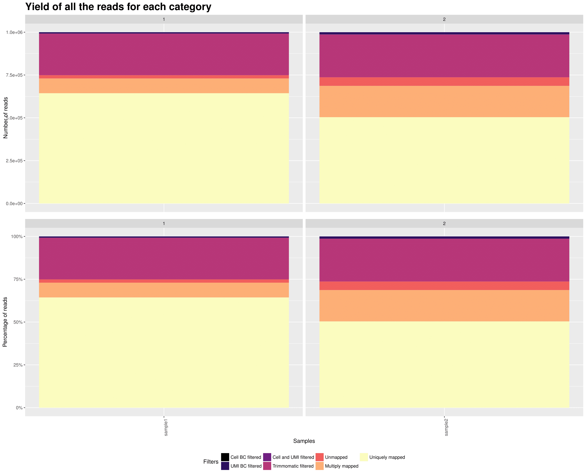
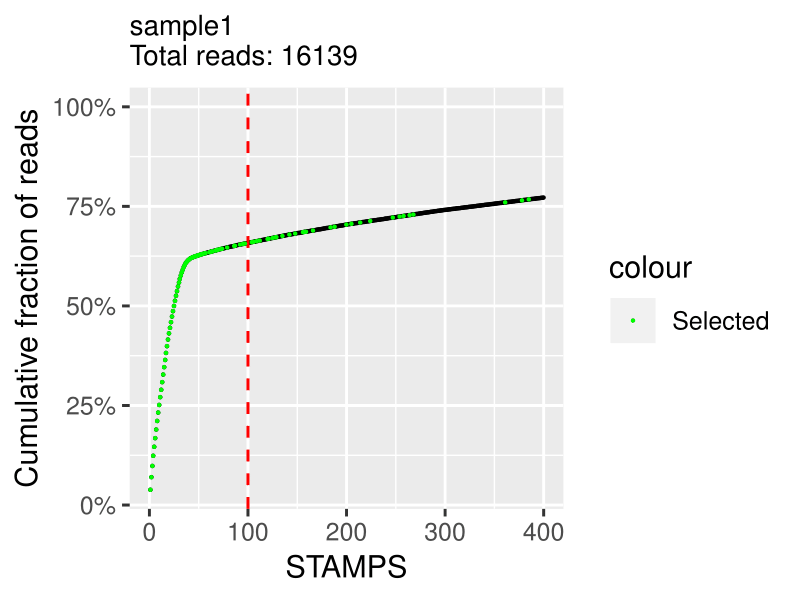
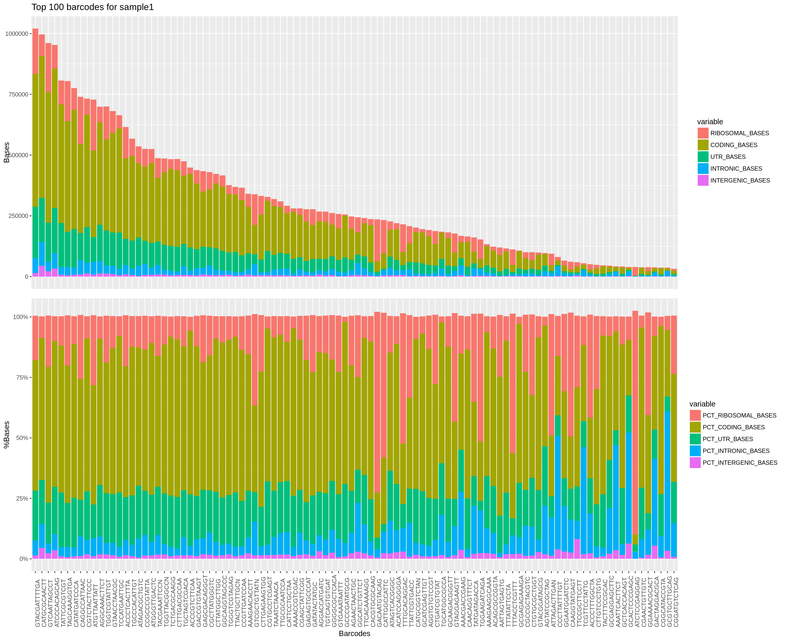
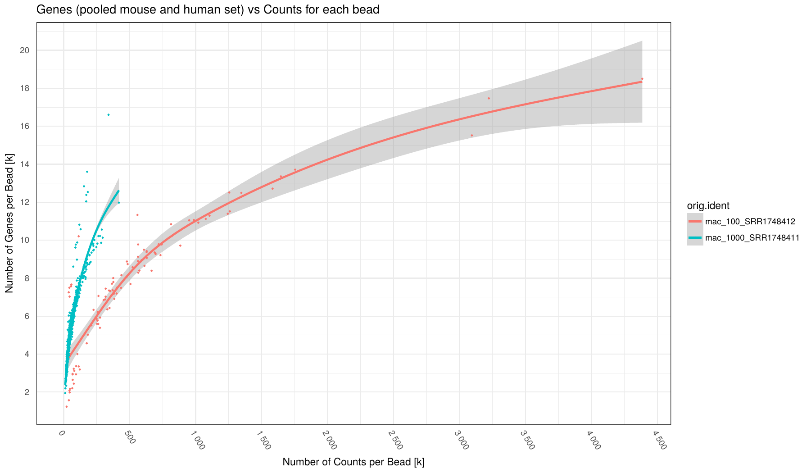
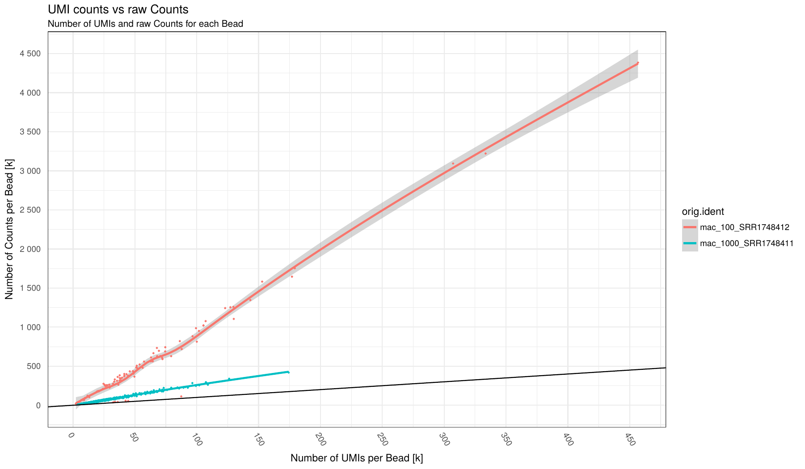
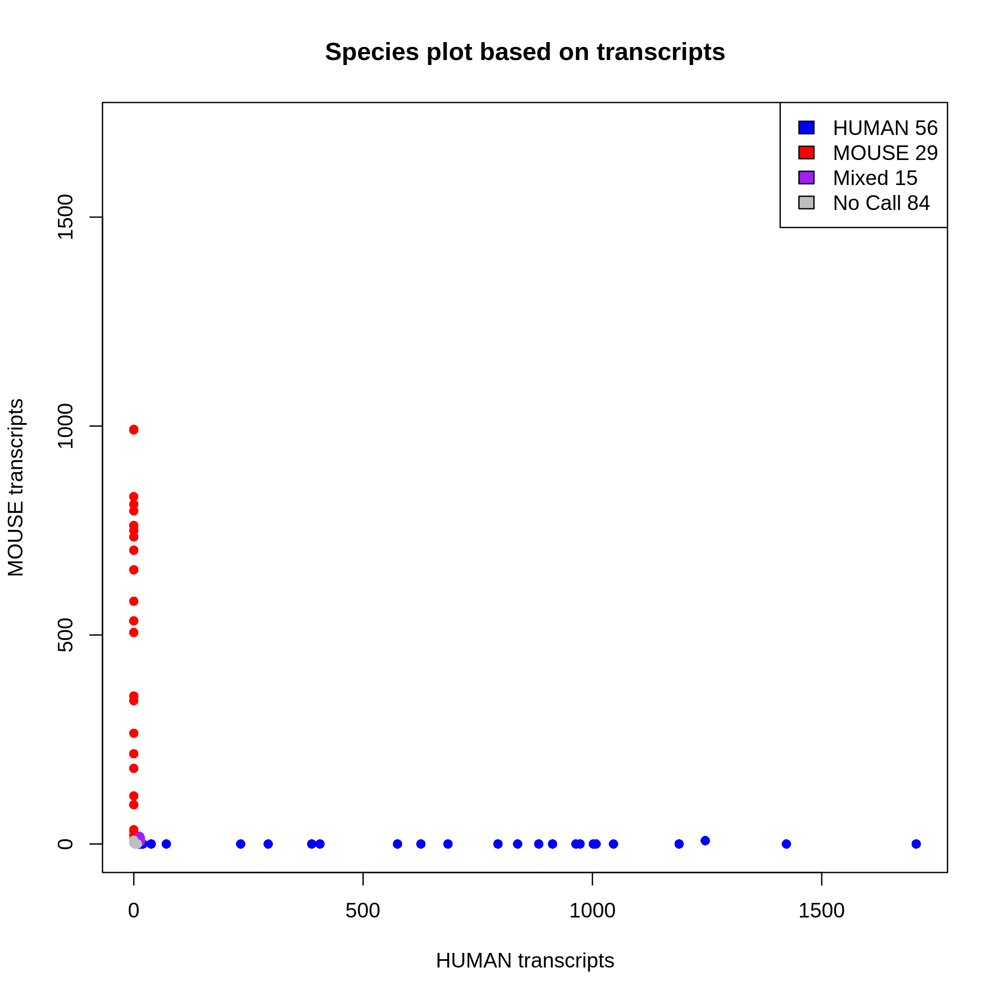

On of the main purpose of this package is getting information about your data to improve your protocol and filter your data for further downstream analysis.

Here is a list of plots and reports that you will get from the pipeline.

Fastqc, STAR and cutadapt reports are generated as [multiqc reports](http://multiqc.info/docs/#using-multiqc-reports) in the reports folder.

## 1. Adapter content

On the x axis are the samples.
On the y axis are the percentages of total adapters that have been found (and trimmed) in respective fastq files based on the `adapter-file` provided via `config.yaml`.

The top plot is for read1 and the bottom for read2.

This plot provides an idea of the which adapter has been found and in which proportion in each sample.

## 2. Yield (across samples)

On the x axis are the samples.  
TOP: On the y axis are the number of reads attributed to each category.
BOTTOM: On the y axis are the percentage of attributed to each category.
This plot gives you an overview of all the reads from your samples and how they are distributed in all the possible categories. The reads that are uniquely mapped ar the ones you will keep at the end for the UMI count matrix.

## 3. Knee plot (per sample)

On the x axis is the cumulative fraction of reads per STAMPS (captured cell).  
On the y axis is the ordered STAMPS (based on total reads).
This allows you to determine how much of the reads you actually captured with the number of cells you expected.
The cutting is based on the `expected_cells` parameter in the `samples.csv` file.
The green `selected cells` are the cells that are going to be in the final expression matrix.
If you see a clear bend on the plot that is higher in the number of cells than what you expected, you should increase the `expected_cells` value and rerun the `extract` step. If it is under, I would advise to filter out your data with a downstream analysis tool such as Seurat.
*Note: I advise not to try to discover "real" cells/STAMPS at this stage. I suggest to extract the expected number of cells and filter out later in post-processing with other kind of meta data.* 

## 4. RNA metrics (per sample)

On the x axis are top barcodes based on your `expected_cells` values or the `barcodes.csv` file.  
Top plot: On the y axis are the number of bases classified by region of mapping.  
Bottom plot: On the y axis are the percentage of bases classified by region of mapping.
This plot gives a lot of different informations. The top plot allows you to quickly compare cells between them in terms of how much has been mapped. This can sometimes help identify outliers or bad runs.
The bottom plot allows you to find cells that have an "abnormal" mapped base distribution compared to other cells.

## 5. Violine plots for barcode properties (across samples)

Various statistic for barcodes that were taken forward as STAMPs as set as `expected_cells` in `config.yaml`.
Each point represents a barcode augmented by a violine-plot density estimator of barcode distribution along the y-axis.

On the x axis are the samples for each panel (Note: the dot distribution along the x-axis does't not bear information, it's just a visual aid to better assess density).
On the y axis are the respecitve statistics described below for each panel.

TOP panel from left to right: 

- nUMI: number of UMI per barcode
- nCounts: number of Counts per barcode
- top50: fraction (percentage/100) of the highest expressed genes compared to entire set of genes. 

BOTTOM: 

- nUMI: average number of UMI per Gene per barcode
- pct.Ribo: Fraction of ribosomal RNA (Note: ribsomal transcripts defined as starting with "^Rpl")
- pct.mito: Fraction of mitochondrial RNA (Note: mitchondrial transcripts defined as starting with "^mt-")

## 6. Saturation plot: UMI per barcode (across samples)

Number of UMI (x-axis) vs number of Genes (y-axis) for each barcode (points in plot) broken down by sample (different colors). 
Number of Genes defined as Genes having at least 1 read mapped to them.
Individual samples are color-coded. A loess regression curve of barcodes for each sample is fitted. 
Various statistic for barcodes that were taken forward as STAMPs as set as `expected_cells` in `config.yaml`.

This plot can indicate how many counts per barcode are required on average to find all expressed genes in a cell.
Given enought coverage, it can also indicate how many genes are expressed for the examined cell type.

## 7. Saturation plot: Counts per barcode (across samples)

Number of Counts (x-axis) vs number of Genes (y-axis) for each barcode (points in plot) broken down by sample (different colors). 
Number of Genes defined as Genes having at least 1 read mapped to them.
Individual samples are color-coded. A loess regression curve of barcodes for each sample is fitted. 
Various statistic for barcodes that were taken forward as STAMPs as set as `expected_cells` in `config.yaml`.

## 8. Counts per UMI per barcode (across samples)

Number of UMI (x-axis) vs number of Counts (y-axis) for each barcode (points in plot) broken down by sample (different colors). 
Individual samples are color-coded. A loess regression curve of barcodes for each sample is fitted. 
Black line indicate an optimal 1:1 ratio between UMI and Counts (i.e. no Duplicates!)

This plots can give an indication on the level of duplication for each sample. The close to black line the lower duplication.

# Mixed experiment

## 9. Barnyard plot (per sample)

This plot shows you species purity for each STAMPS. Mixed and No call STAMPS are dropped and only single species are kept for extraction.
You can change the minimum ratio of transcripts to define a STAMP as mixed or not in the configfile with: `species_ratio`
You get one plot for genes and one plot for transcripts. The selection is done on the transcript level.
