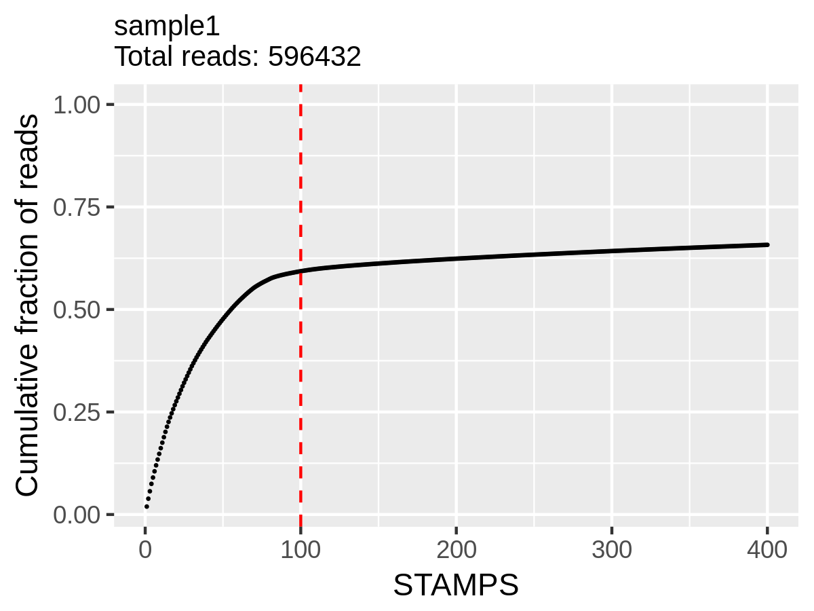

#Plots

One of the main purposes of this package is getting information about your data to improve your protocol and filter your data for further downstream analysis. Below, is a list of plots and reports that you will get from the pipeline.

## 1. QC reports

Fastqc, STAR and cutadapt reports are generated as [multiqc reports](http://multiqc.info/docs/#using-multiqc-reports) in the reports folder.

## 2. Adapter content

This plot provides an idea of the which adapter has been found in which proportion in each sample. The top plot shows results for read 1, the bottom one for read, samples are assigned on the x axis and the y axis are the percentages of total adapters that have been found (and trimmed) in respective fastq files based on the `adapter-file` provided via `config.yaml`.

Below is a list of adapters that can be trimmed off:

Illumina specific adapters:
*Illumina_Universal
*PrefixNX/1
*Trans1
*Trans1_rc
*Trans2
*Trans2_rc
*Nextera

Transcript specific adapters
*polyA
*polyT
*polyC
*polyG

Drop-seq specific adapters
*drop-seq

## 3. Yield (across samples)

On the x axis are the samples.
TOP: On the y axis are the number of reads attributed to each category.
BOTTOM: On the y axis are the percentage of attributed to each category.
This plot gives an overview of the read distribution.  Uniquely mapped reads are kept for the UMI count matrix.

## 4. Knee plot

On the x axis is the cumulative fraction of reads per STAMPS (captured cells).
On the y axis is the ordered STAMPS (based on total reads).
This allows to determine number of cells captured and the amount of reads that assign to cells rather than background reads. The cutting is based on the `expected_cells` parameter in the `samples.csv` file.
The green `selected cells` are the cells that are going to be in the final expression matrix.
If the bend on the plot is higher at a higher number of cells than what was expected increase the `expected_cells` value and rerun the `extract` step. If it is under, filter data with a downstream analysis tool such as Seurat.

## 5. RNA metrics (per sample)

On the x axis are top barcodes based on your `expected_cells` values or the `barcodes.csv` file.
Top plot: On the y axis are the number of bases classified by region of mapping.
Bottom plot: On the y axis are the percentage of bases classified by region of mapping.
The top plot allows for quick comparison of mapping rates between cells, to identify outliers or bad runs. The bottom plot allows to find cells that have an "abnormal" mapped base distribution compared to other cells.

## 6. Violine plots for barcode properties (across samples)

Various statistic for barcodes that were taken forward as STAMPs as set as `expected_cells` in `config.yaml`.
Each point represents a barcode augmented by a violine-plot density estimator of barcode distribution along the y-axis.

On the x-axis are the samples for each panel (Note: the dot distribution along the x-axis doesn’t bear information, it's just a visual aid to better assess density).
On the y axis are the respective statistics described below for each panel.

TOP panel from left to right:

- nUMI: number of UMI per barcode
- nCounts: number of Counts per barcode
- top50: fraction (percentage/100) of the highest expressed genes compared to entire set of genes.

BOTTOM:

- nUMI: average number of UMI per Gene per barcode
- pct.Ribo: Fraction of ribosomal RNA (Note: ribsomal transcripts defined as starting with "^Rpl")
- pct.mito: Fraction of mitochondrial RNA (Note: mitchondrial transcripts defined as starting with "^mt-")

## 7. Saturation plot: UMI per barcode (across samples)

Number of UMIs (x-axis) vs number of Genes (y-axis) for each barcode (points in plot) broken down by sample. Number of Genes defined as Genes having at least 1 read mapped to them. Individual samples are color-coded. A loess regression curve of barcodes for each sample is fitted.

This plot can indicate how many counts per barcode are required on average to find all expressed genes in a cell. Given enough coverage, it can also indicate how many genes are expressed for the examined cell type.

## 8. Saturation plot: Counts per barcode (across samples)

Number of Counts (x-axis) vs number of Genes (y-axis) for each barcode (points in plot) broken down by sample (different colors).
Number of Genes defined as genes having at least 1 read mapped to them.
Individual samples are color-coded. A loess regression curve of barcodes for each sample is fitted.
Various statistic for barcodes that were taken forward as STAMPs as set as `expected_cells` in `config.yaml`.

## 9. Counts per UMI per barcode (across samples)

Number of UMI (x-axis) vs number of Counts (y-axis) for each barcode (points in plot) broken down by sample (different colors).
Individual samples are color-coded. A loess regression curve of barcodes for each sample is fitted.
Black line indicates an optimal 1:1 ratio between UMI and Counts

These plots can give an indication on the level of duplication for each sample. The closer a dataset aligns to the black line the lower the duplication rate.

## 10. Barnyard plot (mixed experiment only)

Only produces in [mixed species experiment](Setting-up-an-experiment.md#
This plot shows species purity for each sample either based on transcripts or genes. 
Mixed and No call STAMPS are dropped and only single species are kept for extraction. The selection is done on the transcript level.
The minimum ratio of transcripts can be altered in `config.yaml`under `species_ratio` to define a STAMP as mixed.
